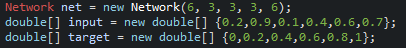

# Artificial Neural Network (ANN)
Created by MarkisJr. to study the applications and build process of Networks.

## Features of this Network:
- Scalable: Input values, hidden neuron and outputs can all be customised to any double value
- Lightweight: Uses little processing power and executes readily and rapidly
- Independent: Free of any external libraries and packages, can be run stand-alone
- Data sets: Allows for learning multiple tasks at the same time
- Set Batching: Sets can be handled in batches for faster processing time
- Saveable: The network can easily be saved to any file extension for modularity
- Loadable: Can load itself from any previously saved network
- Java based: Runs on the java virtual machine meaning the core network code can be ran on any platform that supports java

## Documentation
For information on how to incorperate the ANN into your code, visit the [Wiki](https://github.com/MarkisJr/neuralnetwork/wiki)...

## Current Projects:
- [MNIST database / Guess my Number Program](https://github.com/MarkisJr/neuralnetwork/tree/MNIST-database-learning) - Dedicated to learning numbers from the MNIST database as well as incorperate user interaction.

## Links and Bibliography:
- [Finn Eggers YouTube](https://www.youtube.com/channel/UCaKAU8vQzS-_e5xt7NSK3Xw) *Source of great help*
- [Neural Networks by Sebastian Lague](https://www.youtube.com/watch?v=bVQUSndDllU&list=PLFt_AvWsXl0frsCrmv4fKfZ2OQIwoUuYO) *Source of inspiration*
- [Introduction to ANN design by Daniela Kolarova](https://dzone.com/articles/designing-a-neural-network-in-java) *Understanding*

# Plans for the Future
As this network infrastructure is further developed and expanded more projects will come and improvements will be made.

### Ideas:
- Plot detector
- Image generation
- Chess ai???
- This goat does not exist???
