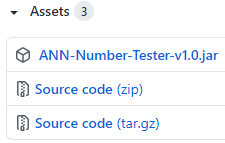
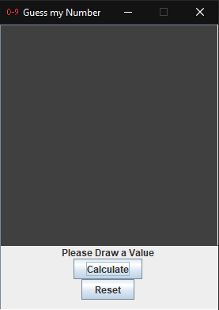
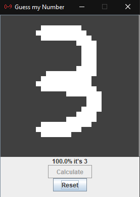

# Training MNIST Database / Guess my Number
#### This branch is dedicated to the development of a number guessing program built on MarkisJr.'s ANN and trained on the MNIST database.

## Context
Initially I planned for this branch to be dedicated to purely learning the MNIST database, a collection of 60 thousand hand drawn numbers freely available to anyone wanting to train their network. Not long after I was inspired to recreate a classic ANN integrated program, taking user drawn images and testing them against data learnt from the MNIST database.

## Structure
I seperated the project into 4 major packages, 3 of them being distributed into the final executable jar. The mnist package, most comprised of classes downloaded from the official MNIST database website, was responsible for training the already built network package with number pictures from the database. The only originally created class in the mnist package was [Mnist.java](src/mnist/Mnist.java) which was designed to integrate with my network. The network and parser packages were simply brought over from the [master](https://github.com/MarkisJr/neuralnetwork/tree/master) branch and had already been previously designed and tested. The totally unique userpanel package was created to house the [MyFrame.java](src/userpanel/MyFrame.java) class, responsible for the user interface and handling user input.

## Downloads
The latest releases of the Guess my Number program and source code can be found [here](https://github.com/MarkisJr/neuralnetwork/releases)

Look for the assets tab and download the executable jar for use.

### Requirements
- [JRE / JDK] 1.8 or later

## Gallery
 

## References
- The MNIST database site (source of MNIST classes): http://yann.lecun.com/exdb/mnist/
